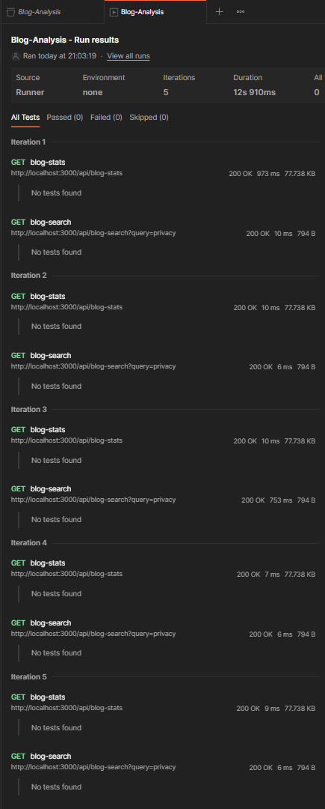

# Blog Analysis - Backend

## Getting started

#### Install required tools

- [Node.js](https://nodejs.org) (v18.x.x)

Core package used in the project

- [express](https://www.npmjs.com/package/express)
- [lodash](https://www.npmjs.com/package/lodash)
- [axios](https://www.npmjs.com/package/axios)
- [dotenv](https://www.npmjs.com/package/dotenv)

#### Clone the repo

```bash
git clone https://github.com/ChRakesh27/BlogAnalysis-Backend.git
cd BlogAnalysis-Backend
```

### Install dependencies

```bash
npm install
```

#### Run local server

Run start will start the server with nodemon in development mode. server start on `http://localhost:3000`

```bash
npm run start
```

#### Lint check

to check code lint. it uses eslint standard recommended rules

```bash
npm run lint
```

### Import postman collection to test the APIs

- [blog-analysis-postman-collection](./postman_collection/Blog-Analysis.postman_collection.json)

### Benchmark API test result from Postman

- benchmark test runs both API


